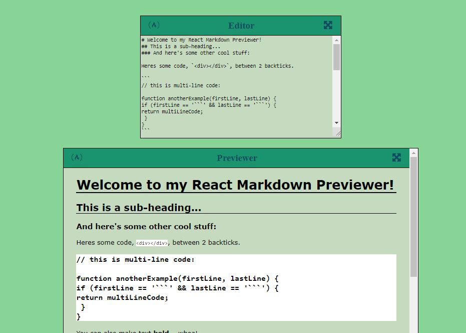

# Markdown Previewer

This is the second challenge on the FreeCodeCamp Front End Development Libraries course.

## Table of contents

- [Overview](#overview)
  - [The challenge](#the-challenge)
  - [Screenshot](#screenshot)
  - [Links](#links)
- [My process](#my-process)
  - [Built with](#built-with)
- [Author](#author)

## Overview

### The challenge

Users should be able to:

- Enter text into the editor and the preview section is updated as they type
- If user enters GitHub flavoured markdown into the editor, the text should render as HTML in the preview section
- When previewer first loads it should already contain default text with certain elements

- I used vanila JS for this as I wanted to brush up a bit on just keeping it simple for a change.

### Screenshot

### Links

- Solution URL: [https://github.com/BiancaNiemann/Markdown_Previewer](https://github.com/BiancaNiemann/Markdown_Previewer)
- Live Site URL: [https://biancaniemann.github.io/Markdown_Previewer/](https://biancaniemann.github.io/Markdown_Previewer/)

## My process

### Built with

- Semantic HTML5 markup
- CSS custom properties
- Javascript

## Author

- Website - [Bianca Niemann](https://portfolio-seven-sepia-13.vercel.app/)
- LinkedIn - [@BiancaNiemann](https://www.linkedin.com/in/bianca-niemann-8671b1246/)
